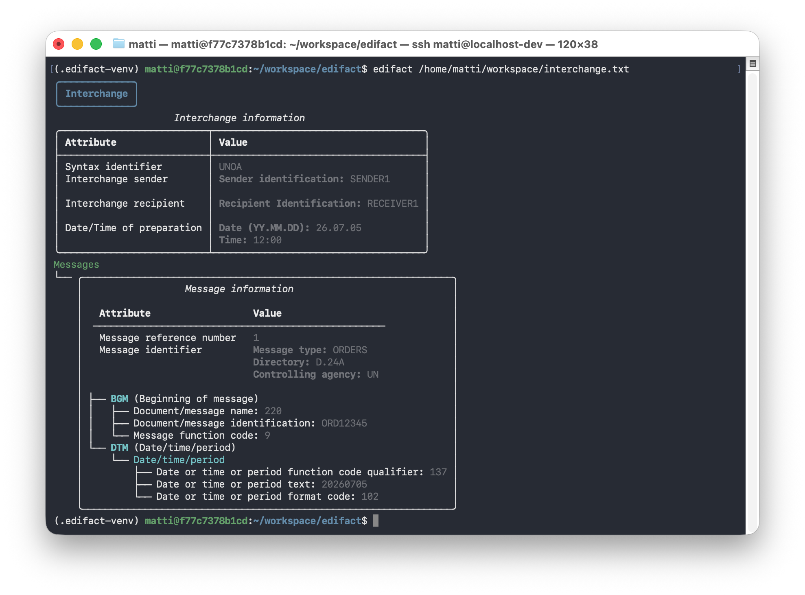
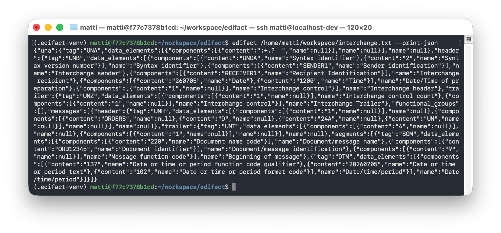

<p align="center">
    
</p>

# edifactlib

A Python package for parsing, validating, and inspecting EDIFACT interchanges. It comes both with a CLI tool for inspecting EDIFACT files directly from the terminal, and with a regular Python library for use in code.

## Installation

```bash
pip install edifactlib
```

## Usage

### As a Python library

```python
from edifactlib import Parser, InterchangeResolver

message = """
UNA:+.? '
UNB+UNOC:3+5412345000013:14+4012345000006:14+260704:1200+REF00001'
UNH+1+ORDERS:D:24A:UN'
BGM+220+PO123456+9'
DTM+137:20260704:102'
NAD+BY+5412345000013::9'
NAD+SU+4012345000006::9'
LIN+1++4712345:EN'
QTY+21:100'
LIN+2++4798765:EN'
QTY+21:50'
UNS+S'
UNT+11+1'
UNZ+1+REF00001'
"""

parser = Parser()
interchange = parser.parse(message)

resolver = InterchangeResolver()
resolver.resolve(interchange)
```

`Parser` turns the raw EDIFACT message as an `Interchange` model (segments, data elements, components) and validates it against the corresponding EDIFACT directory by default (pass `validate=False` to `parser.parse(...)` to skip validation). `InterchangeResolver` then enriches the parsed data with the names/descriptions from the directory.

### Command line

After installation, the `edifact` command is available.

Read and inspect an EDIFACT file:

```bash
edifact /path/to/message.edi
```

Alternatively, pass the message directly as a string:

```bash
edifact --from-string "UNA:+.? 'UNB+UNOC:3+...'"
```

The interchange header, contained messages, and functional groups are printed to the console in a formatted view:



Pass `--print-json` to print the parsed interchange as JSON instead, e.g. for piping into other tools:

```bash
edifact /path/to/message.edi --print-json
```



## Supported EDIFACT versions and directories

### EDIFACT version

Currently version 2 and 3 are supported. An implementation for version 4 is planned.

### Directories

Currently, the `D.24A` directory is supported. Older directories will follow.

## Transparency regarding AI-generated content

This project values transparency about which content was hand-written and which was created with AI assistance:

- **Source code** under `src/` is mainly **hand-written**. Any AI-generated portions are explicitly **marked** as such.
- **Exception: the `tests` folder.** Test code is created with AI assistance.
- Any AI-generated code within the `tests` folder is marked as such with a corresponding comment in the code.
- If a file in the `tests` folder does not contain such a marker comment, its content was written manually.
- The README.MD file was mostly generated by AI.

## Status

This project is under active development. The API may still change before the first stable release.
